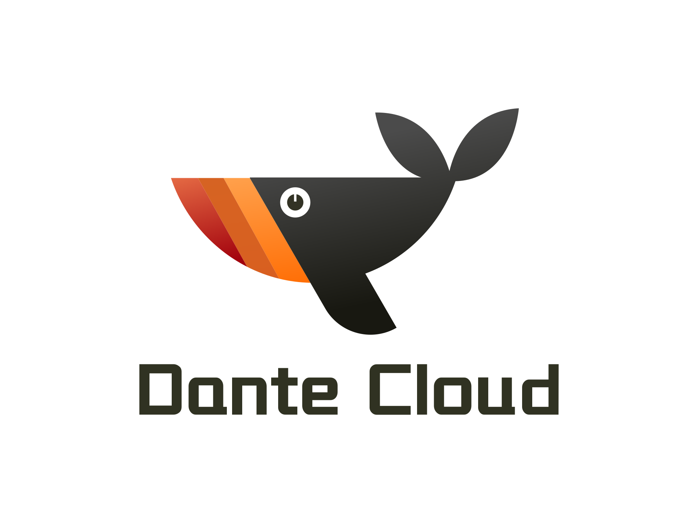

<p align="center"></p>
<h2 align="center">简洁优雅 · 稳定高效 | 宁静致远 · 精益求精 </h2>
<p align="center">Dante Cloud 生态产品 -- ThingsBrain 物联网平台</p>

---

<p align="center">
    <a href="https://spring.io/projects/spring-boot" target="_blank"></a>
    <a href="https://spring.io/projects/spring-cloud" target="_blank"></a>
    <a href="https://github.com/alibaba/spring-cloud-alibaba" target="_blank"></a>
    <a href="https://github.com/Tencent/spring-cloud-tencent" target="_blank"></a>
    <a href="https://nacos.io/docs/latest/overview/" target="_blank"></a>
</p>
<p align="center">
    <a href="https://my.oschina.net/pointerv" target="_blank"></a>
    <a href="./LICENSE"></a>
    <a href="https://bell-sw.com/pages/downloads/#downloads" target="_blank"></a>
    <a href="https://github.com/dante-compass/thingsbrain" target="_blank"></a>
    <a href="https://github.com/dromara/dante-cloud" target="_blank"></a>
    <a href="https://github.com/dante-compass/dante-engine" target="_blank"></a>
    <a href="https://github.com/dante-compass/dante-cloud-ui" target="_blank"></a>
    <a href="https://github.com/dante-compass/herodotus-cloud-ui-vuetify" target="_blank"></a>
    <a href="https://github.com/dante-compass/thingsbrain"></a>
    <a href="https://github.com/dante-compass/thingsbrain"></a>
    <a href="https://gitee.com/dante-compass/thingsbrain"></a>
    <a href="https://gitee.com/dante-compass/thingsbrain"></a>
    <a href="https://www.herodotus.cn"></a>
</p>
<p align="center">
    <a href="https://github.com/dromara/dante-cloud">Github 仓库</a> &nbsp; | &nbsp;
    <a href="https://gitee.com/dromara/dante-cloud">Gitee 仓库</a> &nbsp; | &nbsp;
    <a href="https://www.herodotus.cn">在线文档</a>
</p>

# 开发中，敬请期待！


## [二]、开源协议

### 1. 协议声明

ThingsBrain 项目开源协议为 Apache License Version 2.0。可用于个人学习、毕设，允许商业使用，禁止二次开源。严禁搬运至 CSDN 下载等平台进行售卖。

### 2. 补充条款

使用时务必遵守以下补充条款。

- 不得将本软件应用于危害国家安全、荣誉和利益的行为，不能以任何形式用于非法为目的的行为。
- 在延伸的代码中（修改现有源代码衍生的代码中）需要带有原来代码中的协议、版权声明和其他原作者规定需要包含的说明（请尊重原作者的著作权，不要删除或修改文件中的Copyright和@author信息） ，更不要全局替换源代码中的 Dante Cloud、Dante Engine、ThingsBrain 或 码匠君 等字样，否则你将违反本协议条款承担责任。
- 您若套用本软件的一些代码或功能参考，请保留源文件中的版权和作者，需要在您的软件介绍明显位置 说明出处，举例：本软件基于 Dante Cloud 微服务架构 Dante Engine 或 ThingsBrain，并附带链接：<https://www.herodotus.cn>
- 任何基于本软件而产生的一切法律纠纷和责任，均与作者无关。
- 如果你对本软件有改进，希望可以贡献给我们，双向奔赴互相成就才是王道。
- 本项目已申请软件著作权，请尊重开源。

如果您确实需要删除作者或版权信息，需要争得作者同意及授权。或者在 [【使用公司及组织】](https://gitee.com/dromara/dante-cloud/issues/ICAOHG) 下进行登记，经作者整理登记信息形成表格后，可视为正式授权。

## [五]、工程结构

```shell
herodotus-thingsbrain
├── thingsbrain-dependencies -- ThingsBrain Bom 定义, 统一管理工程模块
├── thingsbrain-kernel -- ThingsBrain 核心定义相关模块
├    ├── thingsbrain-kernel-commons -- 核心定义通用代码模块
├    ├── thingsbrain-kernel-link -- 自定义 Link 协议核心定义代码模块
├    └── thingsbrain-kernel-tsl -- 物模型核心定义代码模块
├── thingsbrain-link -- 自定义 Link 协议相关模块
├    ├── thingsbrain-link-autoconfigure -- 自定义 Link 协议自动配置模块
├    ├── thingsbrain-link-commons -- 自定义 Link 协议通用代码模块
├    ├── thingsbrain-link-manager -- 自定义 Link 协议管理器模块
├    └── thingsbrain-link-commons -- 自定义 Link 协议上报数据存储模块(时序数据)
├── thingsbrain-mqtt -- Mqtt 业务逻辑相关模块
├    ├── thingsbrain-mqtt-autoconfigure -- Mqtt 业务逻辑自动配置模块
├    ├── thingsbrain-mqtt-commons -- Mqtt 业务逻辑通用代码模块
├    ├── thingsbrain-mqtt-inbound -- Mqtt 入站数据业务逻辑实现代码模块
├    └── thingsbrain-mqtt-outbound -- Mqtt 出站数据业务逻辑实现代码模块
├── thingsbrain-nosql -- NoSQL 非结构化数据存储模块
├    ├── thingsbrain-nosql-autoconfigure -- 非结构化数据存储自动配置模块
├    └── thingsbrain-nosql-influxdb3 -- InfluxDB3 封装模块
├── thingsbrain-persistence -- 数据持久化相关模块
├    ├── thingsbrain-persistence-autoconfigure -- 数据持久化自动配置模块
├    ├── thingsbrain-persistence-commons -- 数据持久化通用代码模块
├    ├── thingsbrain-persistence-jpa -- 以 JPA 作为核心业务数据持久化层实现模块
├    └── thingsbrain-persistence-mongodb -- 以 MongoDB 作为核心业务数据持久化层实现模块
├── thingsbrain-platform -- 平台功能相关模块
├    ├── thingsbrain-monolith-application -- ThingsBrain 物联网平台应用(单体版)
├    ├── thingsbrain-platform-authentication -- 设备认证功能逻辑模块
├    ├── thingsbrain-platform-autoconfigure -- 平台功能自动配置模块
└──  └── thingsbrain-platform-rest -- 平台功能 REST 接口模块
```

## [四]、版本分支

### 1. 版本号说明

本系统版本号，分为四段。

- 第一段、第二段和第三段，与 Spring Boot 版本对应，根据采用的 Spring Boot 版本变更。例如，当前采用 Spring Boot 2.4.6 版本，那么就以
  2.4.6.X 开头
- 第四段，表示在当前 Spring Boot 版本下，系统功能维护及优化情况。

本系统未采用传统的、从 1.0.0 开始的版本号，主要基于以下两点考虑：一方面，方便了解对应的 Spring Boot 版本；另一方面，与 Dante Cloud 以及 Dante Engine 匹配对应，以减少不必要麻烦。

### 2. 分支说明

|          分支名称          | 对应 Spring 生态版本                          | 对应 JDK 版本 | 用途             | 现状                                                          |
|:----------------------:|-----------------------------------------|-----------|----------------|-------------------------------------------------------------|
|         master         | Spring Boot 4.1 和 Spring Cloud 2025.1.2 | JDK 25    | 主要发布分支         | 推荐使用代码分支                                                    |
|        develop         | Spring Boot 4.1 和 Spring Cloud 2025.1.2 | JDK 25    | Development 分支 | 新功能、ISSUE 均以此分支作为开发，发布后会 PR 至 master 分支                     |


## [十]、关注我

<table align="center">
  <tr>
    <th align="center">
      <p>公众号：码匠君</p>
    </th>
  </tr>
  <tr>
    <td align="center">
      
    </td>
  </tr>
</table>